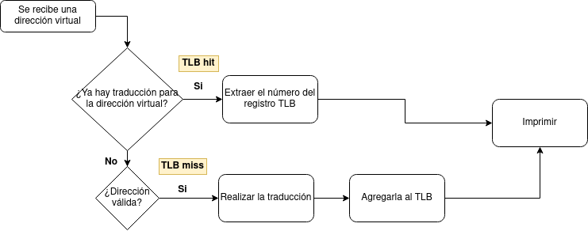

# Planteamiento

Escriba un programa en C que realice la traducción de direcciones de memoria en un sistema que
tiene un espacio virtual de direccionamiento de 32 bits con páginas de 4 KB. El programa debe leer
de manera indefinida y hasta que el usuario pulse la letra ‘s’, una dirección virtual en decimal y
mostrar: 

- (a) el número de página
- (b) el desplazamiento dentro de la página
- (c) el tiempo que tomó la traducción
- (d) si la traducción produce un TLB Hit o un TLB Miss. 
 
Para simular el TLB debe usar memoria en el segmento heap de su programa. Usted define el tamaño y estructura del TLB como
caché de las traducciones. Implemente toda la lógica de la traducción usando el TLB como caché, de
acuerdo con los conceptos explicados en clase.

# Solución

Para realazar el código esperado se necesitan explorar los conceptos de:

## Traducción

Para la traducción se aplicará el método más sencillo. Dada una dirección virtual (19986) dividirla entre el tamaño la página (4KB) y el desplazamiento se calculará con el residuo

### Cálculo de la página

Teniendo en cuenta que:

- Dirección virtual = vd
- tamaño de la página = 4KB => 4096

$\rho = vd // 4096$

### Cálculo del desplazamiento

Teniendo en cuenta que:

- Dirección virtual = vd
- tamaño de la página = 4KB => 4096

$ d = vd % 4096$

## TBL (Translation-lookaside buffer)

Primero se creará una estructura para el Malloc en la cual se tendrá:

## Diagrama de flujo

|Posicion1|Posicion2|Posicion3|Posicion4| 
|---|---|---|---|
|DireccionVirtual|Pagina|Desplazamiento|NumeroDeUsos|

# Recursos utilizados

- https://www.programiz.com/c-programming/c-structures
- https://man7.org/linux/man-pages/man3/malloc.3.html

