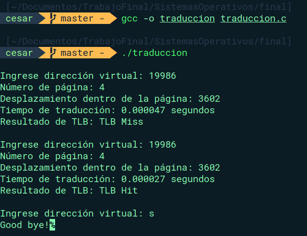
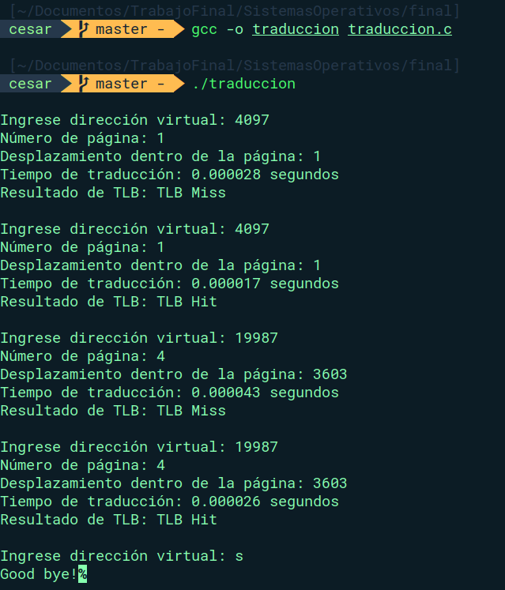

# Planteamiento

Escriba un programa en C que realice la traducción de direcciones de memoria en un sistema que
tiene un espacio virtual de direccionamiento de 32 bits con páginas de 4 KB. El programa debe leer
de manera indefinida y hasta que el usuario pulse la letra ‘s’, una dirección virtual en decimal y
mostrar: 

- (a) el número de página
- (b) el desplazamiento dentro de la página
- (c) el tiempo que tomó la traducción
- (d) si la traducción produce un TLB Hit o un TLB Miss. 
 
Para simular el TLB debe usar memoria en el segmento heap de su programa. Usted define el tamaño y estructura del TLB como
caché de las traducciones. Implemente toda la lógica de la traducción usando el TLB como caché, de
acuerdo con los conceptos explicados en clase.

# Solución

Para realazar el código esperado se necesitan explorar los conceptos de:

## Diagrama de flujo

Se plantea el siguiente diagrama de flujo para realizar la traducción de las direcciones de memoria 


## Traducción

Para la traducción se aplicará el método más sencillo. Dada una dirección virtual (19986) dividirla entre el tamaño la página (4KB) y el desplazamiento se calculará con el residuo

### Cálculo de la página

Teniendo en cuenta que:

- Dirección virtual = vd
- tamaño de la página = 4KB => 4096

$\rho = vd // 4096$

### Cálculo del desplazamiento

Teniendo en cuenta que:

- Dirección virtual = vd
- tamaño de la página = 4KB => 4096

$ d = vd % 4096$


## TBL (Translation-lookaside buffer)

Primero se creará una estructura para el Malloc en la cual se tendrá:

|Posicion1|Posicion2|Posicion3|Posicion4| Posicion5|
|---|---|---|---|---|
|DireccionVirtual|Pagina|Desplazamiento|NumeroDeUsos|Valido|

Lo que se consigue con esto es que se pueda realizar un seguimiento mas rapido a las direcciones traducidas

```c
// Estructura del TLB
struct TBL_struct {
    int virtual_address;   // Dirección virtual
    int page_number;       // Número de la pagina
    int displacement;      // Desplazamiento en la pagina
    int numberUses;        // Veces usada
    bool valid;            // Si esta ocupada o no
};
```


## Funciones usadas

En el código se presentan varias funciones, las principales son:

### tlb_verify

Verifica si un elemento en la estructura tbl coincide con el valor del virtual_address proporcionado, si se encuentra una coincidencia, se actualiza el resultado de búsqueda y se incrementa el número de usos del elemento. Si no se retorna por defecto un `false, 0, 0`


```c
struct TlbResult tlb_verify(struct TBL_struct* tbl, int virtual_address) {
    struct TlbResult result = { false, 0, 0 };

    for (int i = 0; i < TLB_SIZE; i++) {
        if (tbl[i].valid && tbl[i].virtual_address == virtual_address) {
            result.hit = true;
            result.page_number = tbl[i].page_number;
            result.displacement = tbl[i].displacement;
            tbl[i].numberUses += 1;
            break;
        }
    }

    return result;
}
```

### tbl_reemplazo

Esta función realiza las veces de la politica de reemplazo de página, en este caso se tendrá el reemplazo de página por la menos usada.

```c
struct TlbResult tbl_reemplazo(struct TBL_struct* tbl, int virtual_address, int page_number, int displacement) {
    int minIndex = -1;Good bye!
    int minUs = 1000000;
    // find the minimum number of elements in the TBL
    for (int i = 0; i < TLB_SIZE; i++) {
        if (tbl[i].valid && tbl[i].numberUses < minUs) {
            minUs = tbl[i].numberUses;
            minIndex = i;
        }
    }
    tbl[minIndex].virtual_address = virtual_address;
    tbl[minIndex].page_number = page_number;
    tbl[minIndex].displacement = displacement;
    tbl[minIndex].numberUses = 1;
    tbl[minIndex].valid = true;
    usedSlot -= 1;
}
```

### tlb_translateAddress

Traduce una dirección virtual en la TLB y obtiene el número de página y desplazamiento correspondientes.
Si el TBL no tiene capacidad se llama a la función tbl_reemplazo para aplicar la politica de reemplazo del menos usado.

```c
struct TlbResult tlb_translateAddress(struct TBL_struct* tbl, int virtual_address) {
    struct TlbResult result = { false, 0, 0 };
    int page_number = virtual_address / PAGE_SIZE;
    int displacement = virtual_address % PAGE_SIZE;

    if (usedSlot > TLB_SIZE){
        result = tbl_reemplazo(tbl, virtual_address, page_number, displacement);
    } else {
        for (int i = 0; i < TLB_SIZE; i++) {
            if (!tbl[i].valid) {
    
                tbl[i].virtual_address = virtual_address;
                tbl[i].page_number = page_number;
                tbl[i].displacement = displacement;
                tbl[i].numberUses = 1;
                tbl[i].valid = true;
    
                break;
            }
        }

        result.hit = false;
        result.page_number = page_number;
        result.displacement = displacement;
        usedSlot += 1;
    }
    return result;
}
```

## Politica de reemplazo

En el código se aplica la politica de reemplazo del menos usado, para esto 


# Ejemplos de ejecucion





# Recursos utilizados
- [**Manejo de estructuras**](https://www.programiz.com/c-programming/c-structures)
- [**Comando malloc**](https://man7.org/linux/man-pages/man3/malloc.3.html)

