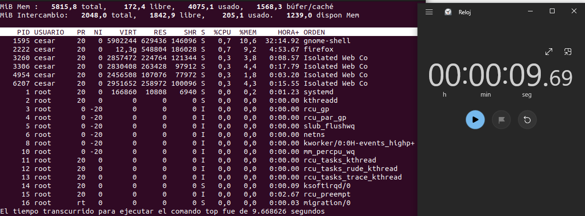

# Planteamiento

Escriba un programa en lenguaje C (en un solo archivo de código) que determine la cantidad de
tiempo necesario para ejecutar un comando pasado como parámetro desde la línea de comandos.
Debe involucrar las funciones `fork()`, `exec()` y `clock_gettime()`, esta última para determinar
la cantidad de tiempo transcurrido.

Cree un proceso hijo que ejecute el comando pasado como parámetro desde la línea de comandos.
Antes de que el proceso hijo ejecute el comando, debe guardar la marca de tiempo actual como
tiempo inicial (obtenida con `clock_gettime()`). Una vez el proceso hijo termine, se debe
registrar la marca de tiempo actual como marca de tiempo final. La diferencia entre el tiempo inicial
y el tiempo final será el tiempo transcurrido para ejecutar el comando pasado como parámetro al
proceso.

Los procesos deben coordinar como van a compartir la marca de tiempo inicial, lo cual involucra
mecanismos de IPC que debe implementar en el código **usando obligatoriamente el mecanismo de
memoria compartida**. La salida debe entregar el nombre del comando ejecutado y el tiempo
transcurrido en segundos y considerando todas las fracciones de segundo que se puedan obtener
con la llamada a `clock_gettime()`, tal como se ilustra a continuación.

Ejemplos
```t
# ./tiempo ls -l
-rwxr-xr-x. 1 root root 8.5K Apr 6 12:25 tiempo
-rw-r--r--. 1 root root 702 Apr 6 15:21 tiempo.c
El tiempo transcurrido para ejecutar el comando ls fue de 0.0002 segundos
```
```t
# ./tiempo top
<Se ejecuta top hasta que el usuario pulsa la letra q para salir de top>
El tiempo transcurrido para ejecutar el comando top fue de 10.023 segundos
```

# Solución

Para solucionar dicho ejercicio se propone el siguiente algoritmo

```c++
// Importación de las librearías necesarias
#include <stdio.h>
#include <stdlib.h>
#include <fcntl.h>
#include <string.h>
#include <sys/mman.h>
#include <unistd.h>
#include <sys/wait.h>
#include <time.h>
#include <semaphore.h>

// Parametros de nombre y size para 
#define SMOBJ_NAME "/myMemoryObj"
#define SMOBJ_SIZE 2000

// Se define el nombre del semáforo
#define SEM_NAME "SEMAFORE"

int main(int argc, char *argv[]) {
        
    // Se almacenará el identificador del proceso
    pid_t pid;

    // Se crea el puntero del semáforo
    sem_t *sem;

    // Se usan las estructuras que proporciona timespec para definir los tiempos de inicio y de fin
    struct timespec end_time;
    

    // Verificación de la entrada de parámetros
    if (argc < 2){
        printf("No se ingresó un comando, indique un comando a medir el tiempo\n");    
        exit(1);
    }


    // Crear el segmento de memoria compartida (fd - FileDescriptor)
    // Se crea con permisos de creación, lectura y escritura
    // Y los permisos de lectura | escritura 
    int fd = shm_open(SMOBJ_NAME,O_CREAT | O_RDWR,0666);

    // Se comprueba la creación de la memoria compartida
    if (fd == -1) {
        printf("Error, la memoria compartida no puedo ser creada");
        exit(1);
    }

    // Fijar el tamaño del segmento de memoria compartida
    // ftruncate(int fildes, off_t length)
    if (ftruncate(fd, SMOBJ_SIZE) == -1){
        printf("Error, A la memoria compartida no se le pudo asignar el tamaño");
        exit(1);
    }

    // Mapeo de la memoria compartida
    // Lo que se pretende hacer es que en la memoria solo se esté guardando el registro de tiempo
    // por lo que se mapea la memoria sobre dicho puntero
    // *ptr = mmap(0,SMOBJ_SIZE, PROT_READ | PROT_WRITE, MAP_SHARED, fd,0);
    struct timespec *ptr = mmap(NULL, sizeof(struct timespec), PROT_READ | PROT_WRITE, MAP_SHARED | MAP_ANONYMOUS, fd, 0);
    if (ptr == MAP_FAILED) {
        printf("Error, MAP_FAILED");
        exit(1);
    }

    // Se pueden usar semáforos con nombre o sin nombre, debido a que
    // la estructura del código se espera ser bastante ordenada se
    // crearán semáforos con nombre
    sem = sem_open(SEM_NAME, O_CREAT, 0666,1);

    pid = fork();

    if (pid == 0){
        // Proceso hijo

        // Se espera a que el padre defina la marca de tiempo 

        // Inicio de la sección crítica
        sem_wait(sem);

        // Se pasa la marca de tiempo a la memoria compartida
        // Se toma el tiempo de ejecución
        clock_gettime(CLOCK_MONOTONIC, ptr);

        // Sale de la sección crítica

        // El valor de tiempo final ya está cargado en memoria para que el padre lo lea
        sem_post(sem);
        
        // Se ejecuta el comando indicado
        execvp(argv[1], &argv[1]);
        printf("Error al ejecutar el comando");
        exit(1);
    }else{
        
        // Padre: Tomar la marca de tiempo inicial, esperar a que el hijo termine, y calcular el tiempo transcurrido
        // Esperar a que el hijo termine
        wait(NULL); 
        
        // Inicio de la sección crítica
        sem_wait(sem);

        // Se toma el registro del tiempo 
        clock_gettime(CLOCK_MONOTONIC, &end_time);

        // Fin de la sección crótica
        sem_post(sem); 

        // Leer la marca de tiempo inicial desde la memoria compartida
        // Se usa "->" debido a que se ese está tomando información desde el puntero de la 
        // memoria compartida
        double totalTime = (end_time.tv_sec - ptr->tv_sec) + (double) (end_time.tv_nsec - ptr->tv_nsec) / 1000000000.0;
        printf("El tiempo transcurrido para ejecutar el comando %s fue de %f segundos\n", argv[1], totalTime);

        // Se cierra el semáforo
        sem_close(sem); // Cerrar el semáforo
        
        // Liberar la memoria compartida
        // *memcpy(void *restrict dest, const void *restrict src, size_t n);
        munmap(ptr, sizeof(struct timespec));

	return 0;
    }

}
```
# Pruebas de ejecuación

## Prueba cuando no se coloca ningun comando


## Prueba para el comando `ls -l`


## Prueba para el comando `top`

Este lo podemos comprobar manualmente el tiempo que dejamos el comando `top`


# Recusos utilizados

- [**Comando shm_open**](https://man7.org/linux/man-pages/man3/shm_open.3.html)
- [**Comando ftruncate**](https://man7.org/linux/man-pages/man3/ftruncate.3p.html)
- [**Comando clock_gettime**](https://man7.org/linux/man-pages/man2/clock_gettime.2.html)
- [**Comando mem (Copiar en memoria)**](https://man7.org/linux/man-pages/man3/memcpy.3.html)
- [**Comando munmap**](https://man7.org/linux/man-pages/man3/munmap.3p.html)
- [**Foro memoria compartida puntero de tiempo**](https://stackoverflow.com/questions/73308620/share-portion-area-of-mmaped-memory)
- [**Video de semáforos**](https://www.youtube.com/watch?v=YC61729PThw&list=PLn9-gi1mj5U7K_Ke9N3uqOFdzNnHUpHhl&index=6)
- [**Video de memoria compartida**](https://www.youtube.com/watch?v=a8tR6d47bCc)